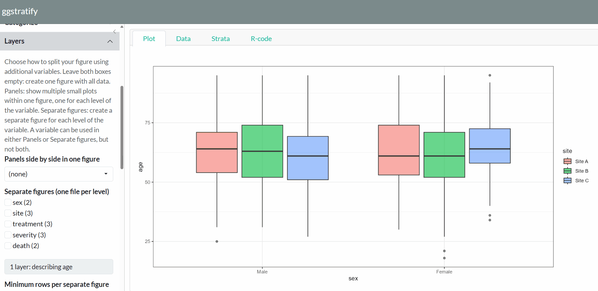

# ggstratify

<a href='https://github.com/AkiShiroshita/ggstratify'>
  
</a>
<br clear="right">

<!-- badges: start -->
[](https://github.com/AkiShiroshita/ggstratify/actions/workflows/R-CMD-check.yaml)
[](https://CRAN.R-project.org/package=ggstratify)
[](https://app.codecov.io/gh/AkiShiroshita/ggstratify?branch=main)
[](https://CRAN.R-project.org/package=ggstratify)
[](https://doi.org/10.5281/zenodo.21961507)
<!-- badges: end -->

**A one-function, point-and-click Shiny interface for the descriptive analysis.**

```r
ggstratify(your_data)
```

That is the only function you need to remember.



## Overview

Descriptive analysis is essential in every research study. Humans (not AI) need to understand the data before making decisions, such as choosing an appropriate statistical model.

In particular, understanding how variables are distributed across strata defined by other variables is often critical.

* Visually inspect your data without repeatedly writing code.

* `ggstratify` runs entirely locally and requires neither a network connection nor a language model.

* Easily export figures to share with collaborators.


### Before you start: decide the variable types

**This package describes what it is given. It does not guess what you meant.**
Convert each column to the type you intend before handing it over.

```r
dat <- transform(
  dat,
  sex       = factor(sex, levels = c("Male", "Female")),   # groups as factors
  severity  = factor(severity, levels = c("Mild", "Moderate", "Severe")),
  age       = as.numeric(age)                              # measurements as numeric
)
ggstratify(dat)
```

A grouping variable left as `1, 2, 3` will be described as a number. The
**order of a factor's levels** becomes the order of the panels, the figures and
the axis.

## Installation

From CRAN:

```r
install.packages("ggstratify")
```

The development version from GitHub:

```r
# install.packages("remotes")
remotes::install_github("AkiShiroshita/ggstratify")
```

## Usage

```r
library(ggstratify)

ggstratify(epi_cohort)           # the example data that ships with the package
ggstratify(iris)                 # data.frame / tibble / data.table / matrix
```

## The screen

| Tab | Contents |
|---|---|
| **Plot** | Either every figure at once as panels (fastest) or one at a time, enlarged. **The variables you chose decide which** (see below) |
| **Data** | The first 200 rows |
| **Strata** | Every stratum: variable, level, N and the file name it will be written to. Strata with no file name get no figure. Plus the rows excluded for missing values |
| **R-code** | The `ggplot2` code for the figure on screen. One button copies it |

## Figure types

`Boxplot` / `Density` / `Dot + Error` / `Dotplot` / `Histogram` /
`Kaplan-Meier curve` / `Line` / `Scatter` / `Violin`

On a **Dot + Error** figure, **Join the dots with a line** under **Plot
options** joins the points left to right -- one line per colour and per panel
-- which is what a set of yearly estimates is usually read for. The line is
computed by the same summary as the dots, so it passes through them.

## Derived variables

**Derive a variable** makes a new variable out of one you already have, which
can then be used as a layer like any other. A continuous variable becomes
quantile groups, equal-width bins or your own cut points. A variable of any
type becomes **missing vs observed**: the rows where it has a value and the
rows where it does not.

A date or date-time variable gets a **time resolution**. Either a calendar
period -- the year, quarter, month, week, day, hour or minute it falls in,
which keeps it a date and so keeps a trend spaced by elapsed time -- or a
position in the cycle, which drops the year and pools every March since the
data began: month of the year, season, quarter of the year, day of the week,
hour of the day. Months run January to December and days Monday to Sunday,
never alphabetically; the season's start month is yours to choose, so March
gives the northern hemisphere and September the southern.

For a `Line` plot drawn against a date, the **Appearance** panel sets how far
apart the ticks are and what each one reads, so a column of dates can be shown
and labelled as years.

`crp` in the bundled `epi_cohort` is incomplete on purpose and `admit_date`
spans three calendar years, so `ggstratify(epi_cohort)` is enough to try
both.

## Survey weights

Set a numeric column as the **Survey weight** under **Describe**, and each row
counts for as many people as its weight -- `aes(weight = survey_weight)` for a
histogram, density, boxplot or violin, and a weighted fit for a smoother. Every
N is shown twice, as rows and as the sum of the weights. The bar on a
**Dot + Error** figure and the band on a Kaplan-Meier curve are design-based
estimates from the [survey](https://CRAN.R-project.org/package=survey) package,
with the **sampling strata** and **clusters** as well when you give them. The
design is the whole sample's, and every panel and figure is a subpopulation of
it. `svy_weight` in `epi_cohort` is there to try it on.

## Acknowledgements

- Claude Code (Anthropic's Claude Opus 5) assisted with adding notes, testing and
  English-language proofreading. The design, decisions and final
  responsibility remain the author's.
- The package design was inspired by
  [ggplotgui](https://github.com/gertstulp/ggplotgui/) (Gert Stulp, GPL-3).

## License

GPL-3
